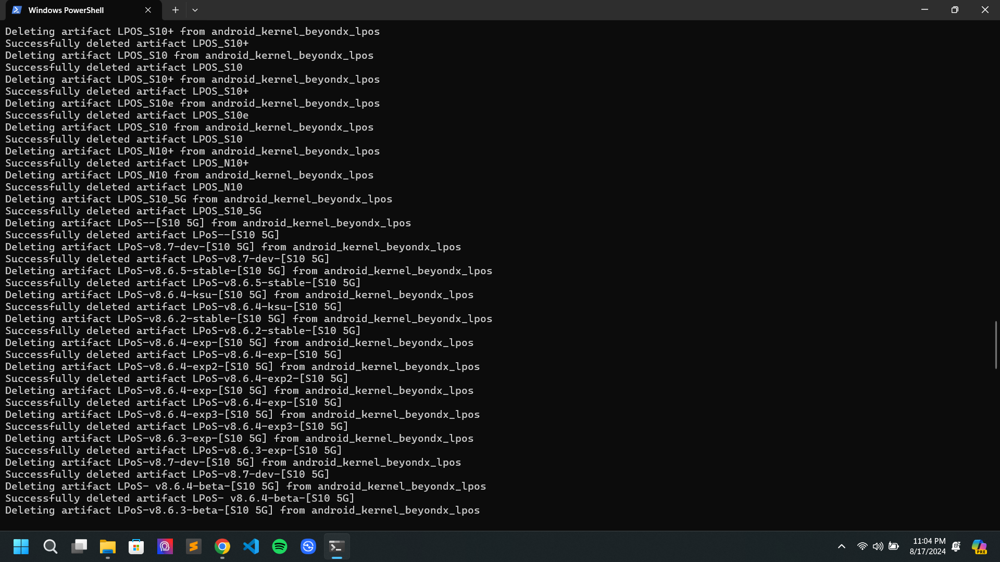

# Delete-Artifacts

This simple Python script allows you to delete all the artifacts you've created throughout your entire GitHub lifetime to save some space. :)

## Screenshot



## Setup

1. Install the required packages:
   ```
   pip install PyGithub requests
   ```

2. Add your GitHub token to `delete-artifacts.py`.

3. Run the script:
   ```
   python delete-artifacts.py
   ```